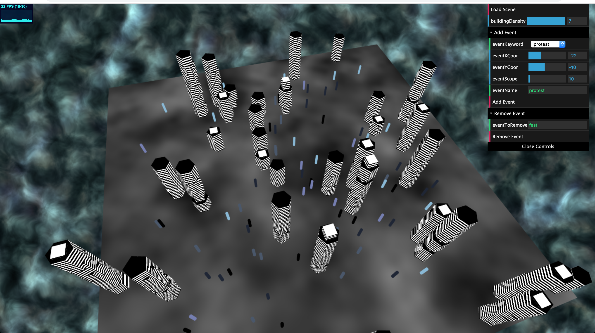
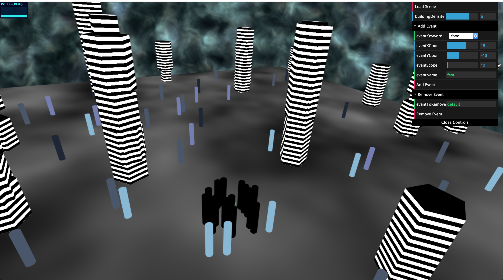
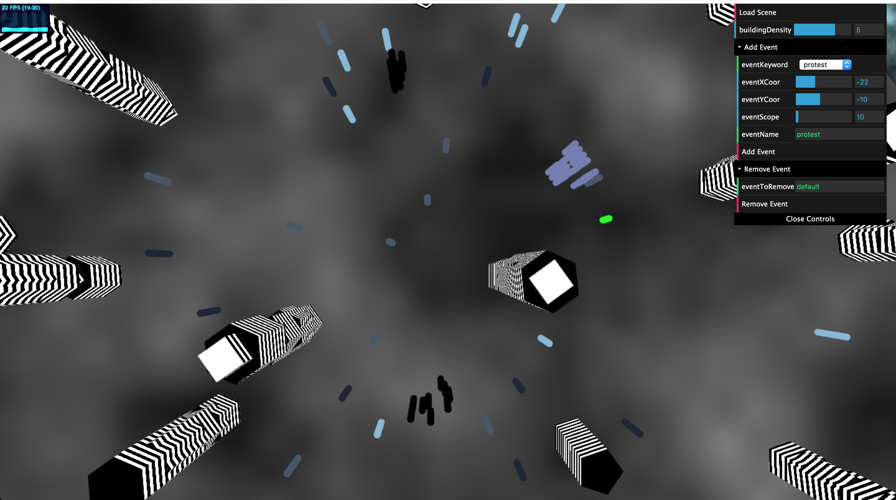

# Crowd Simulation
Final project for CIS566 (Procedural Computer Graphics) Milestone

Name: Gizem Dal

Pennkey: gizemdal

Live demo: https://gizemdal.github.io/crowd_simulation/

Resources: My main resources include my old implementations from previous assignments such as procedural sky and instanced rendering as well as lecture slides on Biocrowds. As I listed in previous assignment README files, _The Book of Shaders_ (https://thebookofshaders.com) has been a very helpful resource.

-----

## End Goal:
My end goal for this project is to build a "realistic" crowd simulation environment where agents move around based on not only location occupancy/vacancy but also personal goals and events happening around the city.

## Features and Techniques:
The simulation consists of a group of agents (the number set initially is 75), procedurally generated buildings and a terrain plane on which the simulation happens.

### Location Map:
When the simulation starts, a 2-D number array that represents the "location map" is created with the dimensions of the plane. All the grids are initially set to have the value 0, which indicates that the grid is vacant. This data structure is used later on in the program to check for agent movement validity and collision with the buildings/other agents.

### Building Generation:
The first step in the simulation is to generate the buildings of the city. The number of the buildings to be generated can be determined by the user by changing the building density coefficient from the GUI menu. Random locations to generate the buildings are picked (each selected position goes through a check whether the location is already occupied by another building and may go through re-selection) by using a getRandomInt() method that returns a random integer number between a given range. Once the building is put into the position, the neighboring cells inside a given radius are also marked occupied as occupied to avoid having intersecting buildings and agents colliding with buildings. The grids that are occupied by the buildings are marked in the location map by value -1. The meshes imported for the buildings include cube, pentagon and hexagon. All buildings are given a random height (within a predefined range of 5-15) and a while loop is used to start from the top of the building and add floors downwards until the building reaches the ground. The mesh to represent the floors is picked randomly among the three possible options (cube, pentagon and hexagon).

### Markers:
A marker is basically a location in the map where an agent can exist. I'm using markers in the simulation to make the agent movements more natural and realistic. After the buildings are generated, I create a large amount of markers (100 times larger than the number of agents in the simulation) and determine their locations in the plane randomly (each selected position goes through a check whether the position is already occupied by another building and may go through re-selection).

### Agents:
An agent is basically an cylindric object representing a "person" that has a position, a destination and interests. An agent's goal in the simulation is to reach its given destination. Movements of the agents happen by traveling through markers. When an agent is on a marker, in order to get closer to its destination, it picks the marker inside a given scope radius that will take it closer to its destination. This selection is calculated by a weight algorithm where the weight of an marker is caulated by 1 plus the cosine of the angle between destination and marker vectors (a destination vector is basically the vector between the destination and agent position points while a marker vector is the vector between the marker and agent position) divided by 1 plus the marker vector's length. The marker with the highest weight is selected as the agent's next position in the next simulation step (an additional check is made whether the selected marker is already occupied by another agent already). The most important feature that differentiates this crowd simulation from any other collision check based simulation is that agent's have interests that affect their destinations and movement decisions. An interest is basically a keyword that is linked to a category of events. For instance, if an agent has "concert" as an interest keyword, then its movement around the could be affected if there is an event happening somewhere in the city with the keyword "concert" (events will be described in the next section). Each agent initially has one interest which is assigned randomly from an initially hardcoded list of interests ('food', 'concert', 'sports', 'protest', 'exposition'). Agents that have the same initial interest have the same color.

### Events:
Events are used as influences for agent's destinations and movement decisions. An event has a position, a keyword and a name. Whenever an event with a given keyword happens in the city, all the existing agents that have the event keyword among their interests will have their destinations updated to be the location of the event. If there are multiple events from the same category, the destination event will be picked randomly among those. Once an agent interested in an event reaches the event destination, it will stay there until the event ends (which means until the user removes this event). Events can be created by the user from the GUI menu by entering an event location, category and name (the event will be created if another event with the same name doesn't exist). The green cylinder that is initially in the middle of the screen is used as a pin to visualize the location of the event to be added, if the user proceeds to actually add the event. An event can also be removed from the city by entering the event name to the GUI menu, which will result in agents either moving to a different event from the same category, or wandering around if there isn't any happening event of interest (until the user creates another event of interest).

### Simulation Step:
A simulation step is basically updating the crowd simulation by one step per agent. The method simulationStep() is called inside the tick() function in main in every iteration to have an ongoing crowd simulation. In each simulation step, the next marker that the agent can go to is determined. The function generates new destination points for agents that have already reached their destination and currently not attending any events.

### Textures:
The textures of the terrain plane, the buildings and the background are generated procedurally in the fragment shader by the use of toolbox functions such as fractal brownian motion, squarewave, etc. The texture for the background is taken from an example in _The Book of Shaders_.

### Control Menu:
The control menu allows the user to change the building density in the city as well as add/remove events. In order to add an event, the user can enter a coordinate and a name for the event and pick a category from the dropdown menu. By using the sliders for the coordinates of the event, the user can see where this coordinate falls to from the bright green cylinder. In order to remove an event, the user needs to enter the name of the event to be removed (nothing will happen if there is no existing event with the given name).

-----

## Progress Images:

### Far screenshot of the milestone:

### Near screenshot of the milestone:

### An event happening in the city:

### Multiple events happening in the city:

