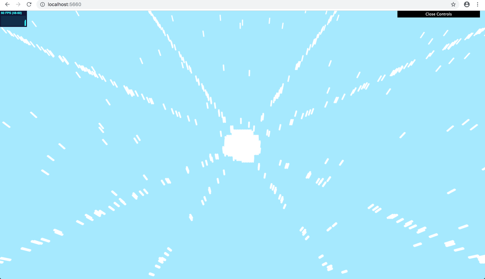

# Crowd Simulation
Final project for CIS566 (Procedural Computer Graphics) Milestone

Name: Gizem Dal

Pennkey: gizemdal

Live demo: https://gizemdal.github.io/crowd_simulation/

Resources: My main resources include my old implementations from previous assignments such as procedural sky, instanced rendering. As I listed in previous assignment README files, _The Book of Shaders_ (https://thebookofshaders.com) has been a very helpful resource.

-----

## End Goal:
My end goal for this project is to build a "realistic" crowd simulation environment where agents move around based on not only location occupancy/vacancy but also personal goals and events happening around the city.

## Milestone features:
For this milestone, I had the following goals:
1) Decide how to represent agents and their interactions
2) Be able to move agents towards a destination
3) Check for agent collisions and avoid agents crossing over each other

My current implementation contains a simple crowd simulation where the agents (I picked the number of agents as 1000 for testing) try to move towards the center of the plane. Although, there is still room for improvement such that the clustering becomes more "natural" rather than rectangular in the center area, which will require a more advanced path finding algorithm. Another thing I wanted to test out was being able to use terrain elevation with movement decision, yet I'm still running into the shader issues I encountered in HW6 so I'm hoping to fix that soon.

-----

## Screenshots from Milestone:

### Far screenshot:

### Near screenshot:

